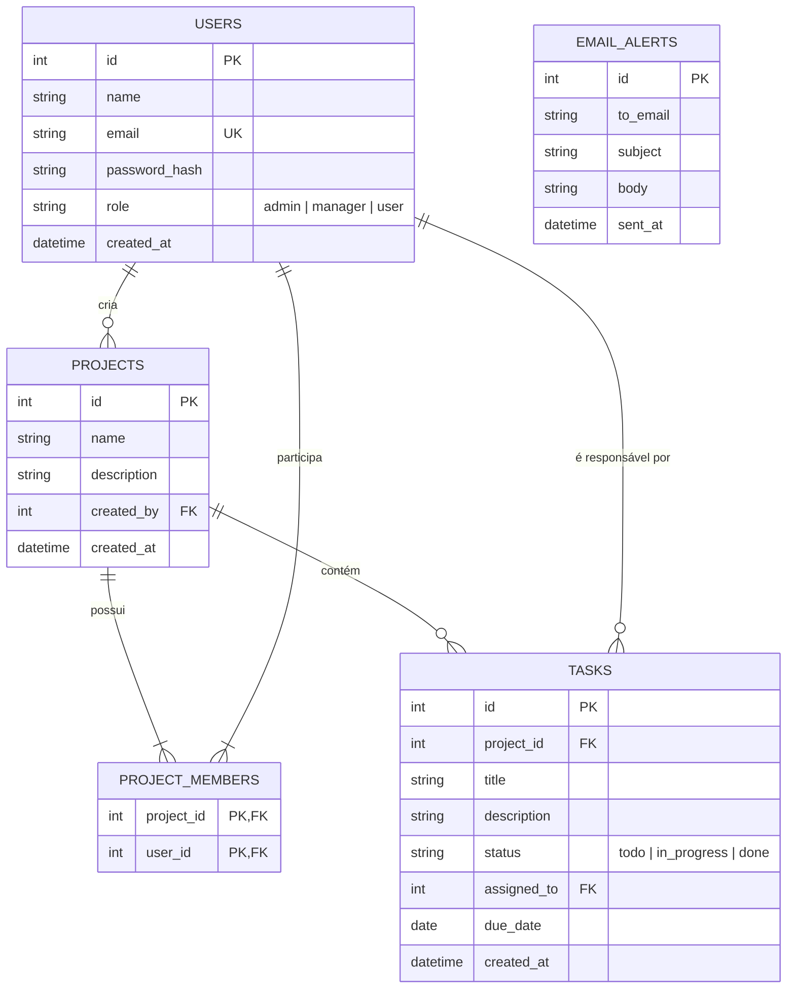

# Documentação do Projeto: TaskFlow
## Sistema de Gerenciamento de Projetos e Tarefas

Este documento consolida os Requisitos Funcionais (RF), Requisitos Não Funcionais (RNF), as Histórias de Usuário (HU) e a Modelagem do Banco de Dados para a Atividade de Recuperação da disciplina de Residência Tecnológica V.

---

## 1. Requisitos Funcionais (RF)

| Código | Descrição | Status no Sistema |
| :--- | :--- | :--- |
| **RF01** | O sistema deve permitir o cadastro de usuários. | **Implementado** (Tela de cadastro e API `/api/auth/register`) |
| **RF02** | O sistema deve permitir login e autenticação. | **Implementado** (Autenticação JWT segura via cabeçalhos) |
| **RF03** | O sistema deve possuir controle de acesso por perfil. | **Implementado** (Restrições para perfis `admin`, `manager` e `user`) |
| **RF04** | O sistema deve permitir o gerenciamento de projetos. | **Implementado** (CRUD de projetos na aba "Projetos" e associação de membros) |
| **RF05** | O sistema deve permitir o gerenciamento de tarefas. | **Implementado** (CRUD completo de tarefas no quadro Kanban) |
| **RF06** | O sistema deve permitir atribuir responsáveis às tarefas. | **Implementado** (Dropdown carregando membros do projeto correspondente) |
| **RF07** | O sistema deve permitir atualizar o status das tarefas. | **Implementado** (Transição de status arrastando ou por botões rápidos) |
| **RF08** | O sistema deve enviar alertas por e-mail. | **Implementado** (Varredura inteligente com simulação visual + SMTP real) |
| **RF09** | O sistema deve gerar relatórios em PDF. | **Implementado** (Relatório executivo gerado em tempo real com `fpdf2`) |
| **RF10** | O sistema deve apresentar um dashboard com indicadores. | **Implementado** (Indicadores estatísticos e gráficos com `Chart.js`) |

---

## 2. Requisitos Não Funcionais (RNF)

| Código | Descrição | Implementação Técnica |
| :--- | :--- | :--- |
| **RNF01**| O sistema deve utilizar banco de dados relacional. | **SQLite3** com suporte ativo a restrições de chaves estrangeiras (`PRAGMA foreign_keys = ON`). |
| **RNF02**| As senhas devem ser armazenadas de forma segura. | Hashing criptográfico de via biblioteca **`bcrypt`** (mecanismo Salt de alta segurança). |
| **RNF03**| O sistema deve possuir interface amigável e responsiva. | Layout responsivo **SPA (Single Page Application)** com design moderno, CSS variables e animações. |
| **RNF04**| O sistema deve validar os campos obrigatórios. | Validação nativa de formulários HTML5 + validação secundária no backend do Flask (retorno 400). |
| **RNF05**| O sistema deve restringir o acesso conforme o perfil do usuário. | Controle centralizado de privilégios usando **Python Decorators** nas rotas do servidor e controle no DOM client-side. |

---

## 3. Histórias de Usuário (HU)

* **HU01**: *Como usuário, quero me cadastrar para acessar o sistema.*
  * **Critério de Aceitação**: Acesso à tela de cadastro. Inserção de nome, e-mail, senha e seleção de perfil para fins de testes. O sistema impede e-mails duplicados.
* **HU02**: *Como usuário, quero realizar login para acessar meus projetos.*
  * **Critério de Aceitação**: Acesso seguro com e-mail e senha. O sistema valida as credenciais e fornece um Token JWT válido por 24 horas. O painel carrega apenas os projetos em que sou participante.
* **HU03**: *Como administrador, quero gerenciar usuários.*
  * **Critério de Aceitação**: Visualização da aba restrita "Usuários" com tabela completa. Capacidade de criar novos usuários com qualquer perfil, editar dados ou excluí-los do banco.
* **HU04**: *Como gerente, quero criar projetos para organizar as atividades.*
  * **Critério de Aceitação**: Acesso ao botão "Novo Projeto". Criação informando nome e descrição. O gerente criador é adicionado como membro automaticamente e pode editar/excluir o projeto a qualquer momento.
* **HU05**: *Como gerente, quero cadastrar tarefas e definir responsáveis.*
  * **Critério de Aceitação**: Criação de tarefas informando título, descrição, prazo final e selecionando um responsável do dropdown contendo somente os membros ativos daquele projeto.
* **HU06**: *Como usuário, quero atualizar o status das minhas tarefas.*
  * **Critério de Aceitação**: O usuário comum visualiza o quadro Kanban e pode transicionar o status (A Fazer ➔ Em Andamento ➔ Concluída) apenas de tarefas que foram atribuídas a ele, ou que participem de seus projetos.
* **HU07**: *Como usuário, quero receber notificações sobre tarefas pendentes.*
  * **Critério de Aceitação**: O sistema varre tarefas perto do prazo de vencimento (menos de 3 dias) ou atrasadas e envia notificações SMTP reais, além de listá-las na aba de Alertas (Inbox Simulado) para controle visual rápido.
* **HU08**: *Como gerente, quero gerar relatórios para acompanhar o andamento dos projetos.*
  * **Critério de Aceitação**: Download instantâneo de arquivo PDF contendo os detalhes, descrição, percentuais de progresso, equipe de membros e lista cronológica de tarefas com respectivos responsáveis e status.

---

## 4. Modelagem do Banco de Dados Relacional

O banco de dados do **TaskFlow** foi projetado seguindo as relações lógicas exigidas:
1. **Um projeto possui várias tarefas (1:N)**.
2. **Um usuário pode participar de vários projetos (N:M)**: Implementado através de uma tabela associativa chamada `project_members`.
3. **Uma tarefa possui um responsável (1:1/1:N)**: A tarefa possui uma chave estrangeira apontando para o responsável.

### Diagrama Entidade-Relacionamento (ER)



### Script de Criação de Tabelas (`schema.sql`)

O script SQL correspondente para criação do banco de dados no SQLite3 é:

```sql
-- Tabela de Usuários
CREATE TABLE IF NOT EXISTS users (
    id INTEGER PRIMARY KEY AUTOINCREMENT,
    name TEXT NOT NULL,
    email TEXT UNIQUE NOT NULL,
    password_hash TEXT NOT NULL,
    role TEXT CHECK(role IN ('admin', 'manager', 'user')) NOT NULL,
    created_at TIMESTAMP DEFAULT CURRENT_TIMESTAMP
);

-- Tabela de Projetos
CREATE TABLE IF NOT EXISTS projects (
    id INTEGER PRIMARY KEY AUTOINCREMENT,
    name TEXT NOT NULL,
    description TEXT,
    created_by INTEGER NOT NULL,
    created_at TIMESTAMP DEFAULT CURRENT_TIMESTAMP,
    FOREIGN KEY (created_by) REFERENCES users(id) ON DELETE CASCADE
);

-- Tabela de Associação de Usuários aos Projetos (N:M)
CREATE TABLE IF NOT EXISTS project_members (
    project_id INTEGER NOT NULL,
    user_id INTEGER NOT NULL,
    PRIMARY KEY (project_id, user_id),
    FOREIGN KEY (project_id) REFERENCES projects(id) ON DELETE CASCADE,
    FOREIGN KEY (user_id) REFERENCES users(id) ON DELETE CASCADE
);

-- Tabela de Tarefas
CREATE TABLE IF NOT EXISTS tasks (
    id INTEGER PRIMARY KEY AUTOINCREMENT,
    project_id INTEGER NOT NULL,
    title TEXT NOT NULL,
    description TEXT,
    status TEXT CHECK(status IN ('todo', 'in_progress', 'done')) DEFAULT 'todo' NOT NULL,
    assigned_to INTEGER,
    due_date DATE,
    created_at TIMESTAMP DEFAULT CURRENT_TIMESTAMP,
    FOREIGN KEY (project_id) REFERENCES projects(id) ON DELETE CASCADE,
    FOREIGN KEY (assigned_to) REFERENCES users(id) ON DELETE SET NULL
);

-- Tabela de Registro de Alertas de E-mail (Simulação)
CREATE TABLE IF NOT EXISTS email_alerts (
    id INTEGER PRIMARY KEY AUTOINCREMENT,
    to_email TEXT NOT NULL,
    subject TEXT NOT NULL,
    body TEXT NOT NULL,
    sent_at TIMESTAMP DEFAULT CURRENT_TIMESTAMP
);
```
